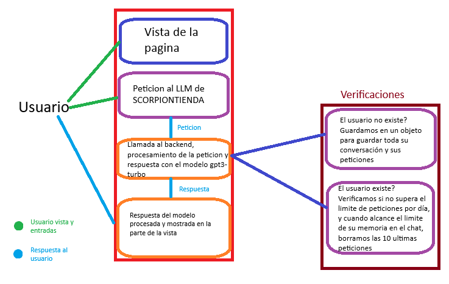

# 🏪 SCORPIONMARKET

SCORPIONMARKET es un mini proyecto que simula una tienda inteligente dentro de la FES Aragón, utilizando React en el frontend y Express en el backend. Integra la API de OpenAI para ofrecer respuestas automáticas a preguntas relacionadas con productos, precios, horarios y más. Además, mantiene una memoria de conversación por usuario, lo que permite una experiencia más natural y coherente.

## 📌 Descripción General

El objetivo del proyecto es aprender a implementar correctamente la API de OpenAI (Chat Completions), gestionar interacciones mediante prompts personalizados, y establecer una memoria temporal de conversación por usuario. También se implementa una política de límites por usuario (máximo de prompts por día), y se conecta el frontend con el backend de forma segura mediante CORS y variables de entorno.

## 🧰 Tecnologías Utilizadas

### Backend
- **Node.js** con **Express.js** para la lógica del servidor
- **OpenAI**: API para procesamiento de lenguaje natural
- **CORS**: Habilita la comunicación segura entre frontend y backend
- **Dotenv**: Gestión segura de variables de entorno

### Frontend
- **React** para la interfaz del usuario
- **Axios** para hacer peticiones HTTP al servidor backend

## 📊 Diagrama de Caso de Uso General

## 🧠 Lógica del Backend

1. **Configuración**  
   Se carga la configuración del entorno con `dotenv`, y se inicializan las dependencias principales (`express`, `cors`, `openai`, etc).

2. **Variables Clave**
   - Puerto definido en `.env`
   - API Key de OpenAI
   - Límite de prompts por usuario al día (`MaxPromptsPerDay`)
   - Objeto en memoria `usersPerDay` para rastrear solicitudes

3. **Control de Límite Diario**
   Se establece un `setInterval` que limpia el registro de usuarios cada 24 horas.

4. **Middlewares**
   - `cors`: Permite solicitudes desde el frontend
   - `express.json()` y `express.urlencoded()`: Permiten manejo de solicitudes con datos en JSON o formularios
   - Middleware personalizado (`MiddlewarePrompt`) que controla cuántas veces un usuario puede solicitar una respuesta por día.

5. **Lógica de Conversación**
   - Se almacena un historial de mensajes por usuario
   - Cada conversación comienza con un mensaje de sistema que define el comportamiento del asistente
   - Si se excede el número de mensajes en la conversación, se conservan los últimos para mantener contexto

6. **Producción**
   - Se sirve el frontend desde `dist/` si `NODE_ENV` está en modo `production`

## 💬 Comportamiento del Asistente

El asistente solo responde preguntas relacionadas con:
- Productos disponibles
- Precios
- Horarios
- Ubicación de la tienda
- Métodos de pago

Si el usuario hace una pregunta fuera de esos temas, el asistente responde con un mensaje predeterminado informando que no puede ayudar con eso.

## 🎨 Frontend - React

La interfaz de usuario de **SCORPIONMARKET** está desarrollada con **React**. Su propósito principal es simular una conversación tipo chat entre el usuario y un asistente virtual de tienda, el cual responde mediante una API que conecta con OpenAI.

### ✨ Características principales

- Chat interactivo entre el usuario y el bot.
- Estilos adaptativos usando TailwindCSS.
- Peticiones asincrónicas con Axios hacia el backend.
- Identificación de usuarios mediante una ID única generada al iniciar sesión.
- Diferenciación visual entre mensajes del bot y del usuario.

### 🧠 Funcionamiento general

- Se utiliza el hook `useState` para almacenar el historial del chat en memoria.
- Cada mensaje enviado por el usuario se envía al backend, el cual responde utilizando la API de OpenAI.
- Las respuestas del bot y los mensajes del usuario se renderizan dinámicamente.
- La interfaz está dividida en tres partes:
  1. **Header:** Logo e identificación de la tienda.
  2. **Zona de conversación:** Muestra el historial de chat.
  3. **Formulario de entrada:** Campo para escribir mensajes y botón para enviar.

### 💡 Detalles técnicos

- La ID de usuario se genera al iniciar la aplicación con una combinación de la hora actual (`Date.now()`) y un número aleatorio.
- Se renderizan mensajes a izquierda o derecha dependiendo si el remitente es el bot o el usuario.
- Las peticiones al backend se hacen al endpoint `/pedir`, enviando el mensaje y la ID de usuario.
- Se manejan errores de conexión con mensajes visuales amigables.